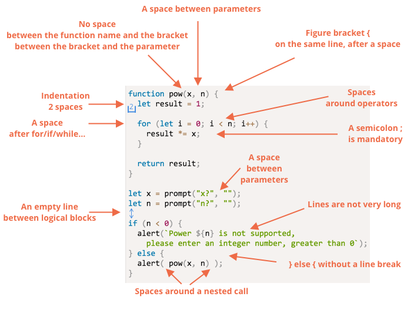
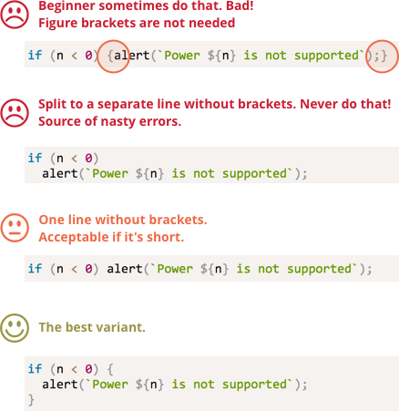

<<<<<<< HEAD
# 代码风格
=======
# Coding Style
>>>>>>> 9b5c1c95ec8a466150e519b0e94748717c747b09

我们的代码必须尽可能的清晰和易读。

<<<<<<< HEAD
这实际是一种编程艺术 —— 以一种正确并且人类易读的方式编码来完成一个复杂的任务。

有一个帮助你（实现上面的目标）的事情就是良好的代码风格。
=======
That is actually the art of programming -- to take a complex task and code it in a way that is both correct and human-readable.
>>>>>>> 9b5c1c95ec8a466150e519b0e94748717c747b09

## 语法

<<<<<<< HEAD
一个含有规则的备忘录（更多细节如下）：
=======
Here is a cheatsheet with some suggested rules (see below for more details):
>>>>>>> 9b5c1c95ec8a466150e519b0e94748717c747b09


<!--
```js
function pow(x, n) {
  let result = 1;

  for (let i = 0; i < n; i++) {
    result *= x;
  }

  return result;
}

let x = prompt("x?", "");
let n = prompt("n?", "");

if (n < 0) {
  alert(`Power ${n} is not supported,
    please enter an integer number, greater than 0`);
} else {
  alert( pow(x, n) );
}
```

-->

现在我们来讨论一下图中的规则和它们的原因吧。

<<<<<<< HEAD
没有什么规则是“刻在石头上”的，每一条都是可选的而且可修改的：这些是编码规则，而不是宗教教条。

### Figure brackets（大括号）

在大多数的 JavaScript 中，大括号（的开始部分）都是写在同一行而不是新换一行。这就是所谓的 "egyptian" 风格。（译者注： "egyptian" 风格又称 K&R 风格 —— 代码段括号的开始位于一行的末尾，而不是另外起一行的风格。）对了，在括号的开始部分前面还有一个空格。

例如：
=======
```warn header="Irony Detected"
Nothing is set in stone here. These are style preferences, not religious dogmas.
```

### Curly Braces

In most JavaScript projects curly braces are written in "Egyptian" style with the opening brace on the same line as the corresponding keyword -- not on a new line. There should also be a space before the opening bracket, like this:
>>>>>>> 9b5c1c95ec8a466150e519b0e94748717c747b09

```js
if (condition) {
  // do this
  // ...and that
  // ...and that
}
```

单行结构也是一个重要的用例。我们是否应该使用括号？如果是，那么在哪里？

<<<<<<< HEAD
下面是这几种情况的注释，你可以自己判断一下它们的可读性：
=======
Here are the annotated variants so you can judge their readability for yourself:
>>>>>>> 9b5c1c95ec8a466150e519b0e94748717c747b09

<!--
```js no-beautify
if (n < 0) {alert(`Power ${n} is not supported`);}

if (n < 0) alert(`Power ${n} is not supported`);

if (n < 0)
  alert(`Power ${n} is not supported`);

if (n < 0) {
  alert(`Power ${n} is not supported`);
}
```
-->


<<<<<<< HEAD
总结：
- 对于很短的代码，一行是可以接受的：例如 `if (cond) return null`.
- 但是括号中的每个语句单独一行通常更好些。

### 行的长度

一行的最大长度应该有所限制。没有人喜欢盯着一条长长的水平线。最好把它分割一下。

一行的最大长度在团队层面上达成一致即可。通常是 80 或 120 个字符。
=======
In summary:
- For very short code, one line is acceptable. For example: `if (cond) return null`.
- But a separate line for each statement in brackets is usually easier to read.

### Line Length

No one likes to read a long horizontal line of code. It's best practice to split them up and limit the length of your lines.

The maximum line length should be agreed upon at the team-level. It's usually 80 or 120 characters.
>>>>>>> 9b5c1c95ec8a466150e519b0e94748717c747b09

### 缩进

有两种类型的缩进：

<<<<<<< HEAD
- **水平方向上的缩进: 2(4) 个空格。**
=======
- **Horizontal indents: 2 or 4 spaces.**
>>>>>>> 9b5c1c95ec8a466150e519b0e94748717c747b09

    一个水平缩进通常由 2 或 4 个空格或者 "Tab" 制表符构成。选择哪一个方式是一场古老的圣战。如今空格更普遍一点。

    选择空格而不是 tabs 的优点之一是它们允许你做出比 “Tab” 制表符更加灵活的缩进配置。

    例如，我们可以将参数和括号的开头对齐，像下面这样：

    ```js no-beautify
    show(parameters,
         aligned, // 左边有 5 个空格
         one,
         after,
         another
      ) {
      // ...
    }
    ```

<<<<<<< HEAD
- **垂直方向上的缩进：用于将逻辑块中的代码进行分割的空行。**

    即使是单个函数通常也被分割为数个逻辑块。在下面的例子中，初始化的变量、主要的循环结构和返回值都被垂直分割了。
=======
- **Vertical indents: empty lines for splitting code into logical blocks.**

    Even a single function can often be divided into logical blocks. In the example below, the initialization of variables, the main loop and returning the result are split vertically:
>>>>>>> 9b5c1c95ec8a466150e519b0e94748717c747b09

    ```js
    function pow(x, n) {
      let result = 1;
      //              <--
      for (let i = 0; i < n; i++) {
        result *= x;
      }
      //              <--
      return result;
    }
    ```

    插入一个额外的空行有助于让代码更加地易读。连续超过 9 行都没有被垂直分割的代码是不应该出现的。

<<<<<<< HEAD
### 分号

每一个语句后面都应该有一个分号。即使它可能会被跳过。

有一些语言的分号是可选的。那些语言中很少使用分号。但是在 JavaScript 中，极少数情况下，换行符有时不会被解释为分号。这些地方会造成编程错误。

随着你变得更加成熟，你可以选择一个无分号的风格，比如 [StandardJS](https://standardjs.com/)，但只有当你熟悉 Javascript 并理解了可能的缺陷时才会这样。

### 嵌套的层级

你不应该嵌套太多的层级。

有时候在循环中使用 ["continue"](info:while-for#continue) 指令避免额外的 `if(..) { ... }` 嵌套是一个好主意：

例如：
=======
### Semicolons

A semicolon should be present after each statement, even if it could possibly be skipped.

There are languages where a semicolon is truly optional and it is rarely used. In JavaScript, though, there are cases where a line break is not interpreted as a semicolon, leaving the code vulnerable to errors.

As you become more mature as a programmer, you may choose a no-semicolon style like [StandardJS](https://standardjs.com/). Until then, it's best to use semicolons to avoid possible pitfalls.

### Nesting Levels

Try to avoid nesting code too many levels deep.

Sometimes it's a good idea to use the ["continue"](info:while-for#continue) directive in a loop to avoid extra nesting.

For example, instead of adding a nested `if` conditional like this:
>>>>>>> 9b5c1c95ec8a466150e519b0e94748717c747b09

```js
for (let i = 0; i < 10; i++) {
  if (cond) {
    ... // <- 又一层嵌套
  }
}
```

我们可以这样写：

```js
for (let i = 0; i < 10; i++) {
  if (!cond) *!*continue*/!*;
  ...  // <- 没有额外的嵌套
}
```

使用 `if/else` 和 `return` 可以做类似的事情。

例如，下面的两个结构是相同的。

<<<<<<< HEAD
第一个：
=======
Option 1:
>>>>>>> 9b5c1c95ec8a466150e519b0e94748717c747b09

```js
function pow(x, n) {
  if (n < 0) {
    alert("Negative 'n' not supported");
  } else {
    let result = 1;

    for (let i = 0; i < n; i++) {
      result *= x;
    }

    return result;
  }
}
```

<<<<<<< HEAD
还有这个：
=======
Option 2:
>>>>>>> 9b5c1c95ec8a466150e519b0e94748717c747b09

```js
function pow(x, n) {
  if (n < 0) {
    alert("Negative 'n' not supported");
    return;
  }

  let result = 1;

  for (let i = 0; i < n; i++) {
    result *= x;
  }

  return result;
}
```

<<<<<<< HEAD
但是第二个更加的可读，因为 `n < 0` 这个”边缘情况“已经提前被处理过，并且我们有一个 ”主“ 代码流，而不需要额外的嵌套。

## 函数在代码下面

如果你正在写几个”辅助类“的函数和一些使用它们的代码，有三种方式来放置它们。

1. 函数在调用它们的那些代码之上：
=======
The second one is more readable because the "edge case" of `n < 0` is handled early on. Once the check is done we can move on to the "main" code flow without the need for additional nesting.

## Function Placement

If you are writing several "helper" functions and the code that uses them, there are three ways to organize the functions.

1. Functions declared above the code that uses them:
>>>>>>> 9b5c1c95ec8a466150e519b0e94748717c747b09

    ```js
    // *!*函数声明*/!*
    function createElement() {
      ...
    }

    function setHandler(elem) {
      ...
    }

    function walkAround() {
      ...
    }

    // *!*使用函数的代码*/!*
    let elem = createElement();
    setHandler(elem);
    walkAround();
    ```
2. 先写代码，再写函数

    ```js
    // *!*the code which uses the functions*/!*
    let elem = createElement();
    setHandler(elem);
    walkAround();

    // --- *!*helper functions*/!* ---
    function createElement() {
      ...
    }

    function setHandler(elem) {
      ...
    }

    function walkAround() {
      ...
    }
    ```
<<<<<<< HEAD
3. 混合，函数定义在它第一次被使用的地方。
=======
3. Mixed: a function is declared where it's first used.
>>>>>>> 9b5c1c95ec8a466150e519b0e94748717c747b09

大多数时候，第二种方式更好。

<<<<<<< HEAD
这是因为当在阅读代码时，我们首先想要知道的是“它做了什么”。如果代码先行，它就会提供这些信息。或许我们一点也不需要阅读这些函数，尤其是他们的名字足够表示出他们做了什么的时候。

## 风格指南

风格指南包含了“如果编写代码”的通用规则：使用什么引号、用多少空格来缩进、哪里放置换行等等很多的小细节。

总的来说，当团队中的所有成员都使用同样的风格指南时，代码看起来是统一的。无论团队中谁写的，都是一样的风格。

当然，一个团队可能会考虑一个他们自己的风格指南。但是现在，他们没必要这样做。现在有很多已经尝试过并制作好的风格指南，可以很容易采用。

例如：
=======
That's because when reading code, we first want to know *what it does*. If the code goes first, then it provides that information. Then, maybe we won't need to read the functions at all, especially if their names are descriptive of what they actually do.

## Style Guides

A style guide contains general rules about "how to write" code, e.g. which quotes to use, how many spaces to indent, where to put line breaks, etc. A lot of minor things.

When all members of a team use the same style guide, the code looks uniform, regardless of which team member wrote it.

Of course, a team can always write their own style guide. Most of the time though, there's no need to. There are many existing tried and true options to choose from, so adopting one of these is usually your best bet.

Some popular choices:
>>>>>>> 9b5c1c95ec8a466150e519b0e94748717c747b09

- [Google JavaScript 风格指南](https://google.github.io/styleguide/javascriptguide.xml)
- [Airbnb JavaScript 风格指南](https://github.com/airbnb/javascript)
- [Idiomatic.JS](https://github.com/rwaldron/idiomatic.js)
- [StandardJS](https://standardjs.com/)
<<<<<<< HEAD
- (还有很多)

如果你是一个初学者，你可以从本章中上面的内容开始，然后浏览风格指南并提取出常见规则或者选择一个。

## 自动检测器

有很多工具可以自动检查你的代码风格。他们叫做 "linters"。

它们有一个很棒的地方是风格检测也会发现一些 bug（问题），诸如变量名或者函数书写错误。

因此推荐你安装一个，即使你不想坚持某个 "code style"。它们会帮你找出书写错误 —— 这就已经足够好了。

最出名的工具有：
=======
- (plus many more)

If you're a novice developer, start with the cheatsheet at the beginning of this chapter. Once you've mastered that you can browse other style guides to pick up common principles and decide which one you like best.

## Automated Linters

Linters are tools that can automatically check the style of your code and make suggestions for refactoring.

The great thing about them is that style-checking can also find some bugs, like typos in variable or function names. Because of this feature, installing a linter is recommended even if you don't want to stick to one particular "code style".

Here are the most well-known linting tools:
>>>>>>> 9b5c1c95ec8a466150e519b0e94748717c747b09

- [JSLint](http://www.jslint.com/) -- 第一批 linters 之一。
- [JSHint](http://www.jshint.com/) -- 比 JSLint 多了更多设置。
- [ESLint](http://eslint.org/) -- 可能是最新的一个。

它们都能够做这些工作。笔者使用 [ESLint](http://eslint.org/).

<<<<<<< HEAD
大多数 linters 都可以与编辑器集成在一起：只需在编辑器中启用插件并配置风格即可。
=======
Most linters are integrated with many popular editors: just enable the plugin in the editor and configure the style.
>>>>>>> 9b5c1c95ec8a466150e519b0e94748717c747b09

例如，要使用 ESLint 你应该这样做：

<<<<<<< HEAD
1. 安装 [Node.JS](https://nodejs.org/).
2. 使用 `npm install -g eslint` 命令（npm 是 Node.JS 的包安装工具）安装 ESLint。
3. 在你项目的根目录（包含你所有文件的那个目录）创建一个名叫 `.eslintrc` 的配置文件。

这有一个 `.eslintrc` 的例子：
=======
1. Install [Node.js](https://nodejs.org/).
2. Install ESLint with the command `npm install -g eslint` (npm is a JavaScript package installer).
3. Create a config file named `.eslintrc` in the root of your JavaScript project (in the folder that contains all your files).
4. Install/enable the plugin for your editor that integrates with ESLint. The majority of editors have one.

Here's an example of an `.eslintrc` file:
>>>>>>> 9b5c1c95ec8a466150e519b0e94748717c747b09

```js
{
  "extends": "eslint:recommended",
  "env": {
    "browser": true,
    "node": true,
    "es6": true
  },
  "rules": {
    "no-console": 0,
    "indent": ["warning", 2]
  }
}
```

<<<<<<< HEAD
这里的 `"extends"` 指令表示我们是基于 "eslint:recommended" 的设置项而进行设置的，并且我们还制定了我们自己的规则。

在你的编辑器中安装 / 启用插件以和 ESLint 集成。大多数编辑都有的。

你也可以从网上下载一些风格规则然后扩展它们。查看 <http://eslint.org/docs/user-guide/getting-started> 以获得有关安装的更多详细信息。

使用一个 linter 会有一些很棒的副作用。Linters 可以捕捉错别字。例如，当一个 undefined 变量被访问时，linter 会检测出并把它高亮（如果和编辑器集成了）。在大多数情况下，这都是你打错啦。所以我们可以马上解决它。

因此即使你不关心风格，也推荐你使用一个 linter。

某些 IDE 还支持内置的 linting，但不像 ESLint 那么灵活可配置。
=======
Here the directive `"extends"` denotes that the configuration is based on the "eslint:recommended" set of settings. After that, we specify our own.

It is also possible to download style rule sets from the web and extend them instead. See <http://eslint.org/docs/user-guide/getting-started> for more details about installation.

Also certain IDEs have built-in linting, which is convenient but not as customizable as ESLint.
>>>>>>> 9b5c1c95ec8a466150e519b0e94748717c747b09

## 总结

<<<<<<< HEAD
本章的所有语法规则和样式指南旨在提高可读性，因此所有的内容都是值得商榷的。

当我们思考“如何写地更好”的时候，唯一的标准是“什么会让代码更加可读和容易理解，什么会帮助我们避免错误”。这是当选择一种风格或讨论哪一种更好的时候要牢记的主要原则。

阅读风格指南，以查看相关的最新想法，并遵循那些你发现的最好的。
=======
All syntax rules described in this chapter (and in the style guides referenced) aim to increase the readability of your code, but all of them are debatable.

When we think about writing "better" code, the questions we should ask are, "What makes the code more readable and easier to understand?" and "What can help us avoid errors?" These are the main things to keep in mind when choosing and debating code styles.

Reading popular style guides will allow you to keep up to date with the latest ideas about code style trends and best practices.
>>>>>>> 9b5c1c95ec8a466150e519b0e94748717c747b09
